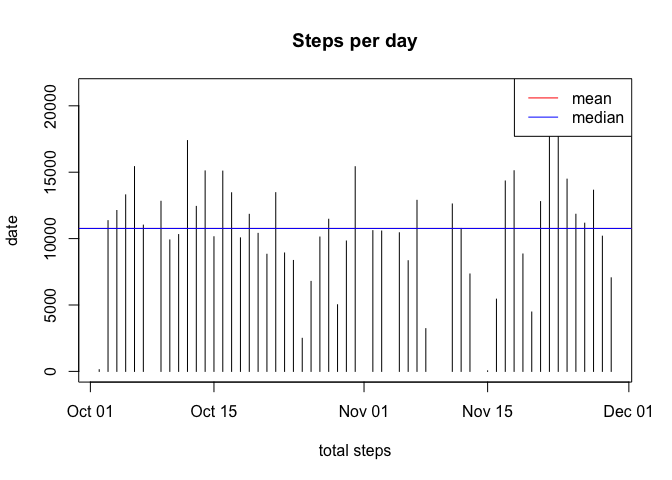
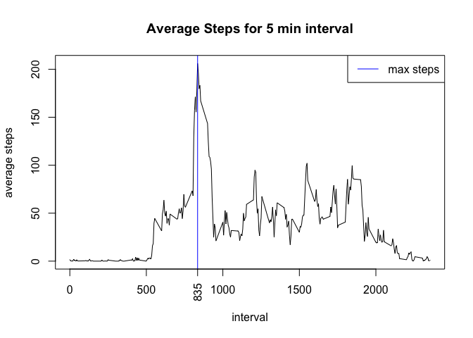
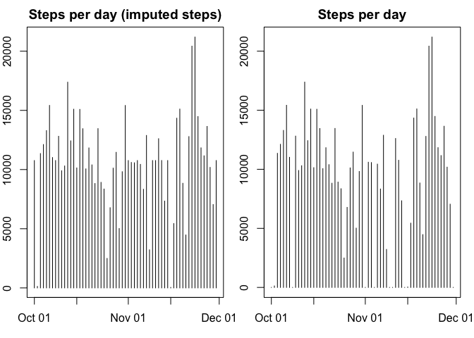
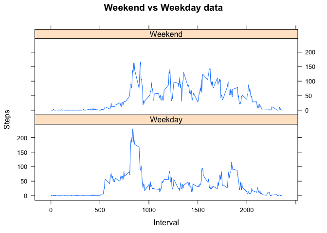

# PA1_template.Rmd

## Loading and preprocessing the data

The activity data is read and loaded in the 


```r
suppressMessages(library(dplyr))
setwd("~/Google Drive/Coursera//DataScience/05-repro-research/")
activity <- read.csv("activity.csv", na.strings = "NA")
activity <- transform(activity, date=as.Date(as.character(date)))
```

## What is mean total number of steps taken per day?


```r
out <- activity  %>% filter(!is.na(steps)) %>% group_by(date) %>% summarize(total=sum(steps,na.rm=TRUE))
plot(out$date, out$total, type="h", xlab="total steps", ylab="date", main="Steps per day")
abline(h=round(mean(out$total)), col="red")
abline(h=median(out$total), col="blue")
legend("topright", c("mean","median"), lty=c(1,1), col=c("red", "blue"))
```

 

The mean for the steps is 1.0766\times 10^{4} and median is 10765. Note that the figure above plots both (abline) but is not easily visible because the values are nearly the same.

## What is the average daily activity pattern?


```r
out_t <- activity %>% filter(!is.na(steps)) %>% group_by(interval) %>% summarize(total=sum(steps,na.rm=TRUE))
max_steps <- max(out_t$total)
max_interval <- out_t[out_t$total== max_steps,][1]

out_m <- activity %>% filter(!is.na(steps)) %>% group_by(interval) %>% summarize(mean=mean(steps,na.rm=TRUE))
plot(out_m$interval, out_m$mean, type="l", ylab="average steps", xlab="interval", main="Average Steps for 5 min interval")
abline(v=max_interval, col="blue")
legend("topright", c("max steps"), lty=c(1), col=("blue"))
axis(at=835, labels=c("835"), las=2, side=1)
```

 

The max steps (10927) is shown as a verticle blue line plotted in the graph

## Imputing missing values
We draw two plots side by side. The first plot is using imputed missing values (mean) and the second is the plot without missing values.


```r
out_j <- activity %>% left_join(out_m, by="interval") %>% 
  mutate (steps1 = ifelse (is.na(steps), round(mean), steps))
out_i <- out_j %>% group_by(date) %>% summarize(total=sum(steps1,na.rm=TRUE))
out_o <- out_j %>% group_by(date) %>% summarize(total=sum(steps,na.rm=TRUE))
par(mfrow= c(1,2), mar=c(3,2,2,1))
plot(out_i$date, out_i$total, type="h", xlab="total steps", ylab="date", main="Steps per day (imputed steps)")
plot(out_o$date, out_o$total, type="h", xlab="total steps", ylab="date", main="Steps per day")
```

 

## Are there differences in activity patterns between weekdays and weekends?


```r
library("lattice")
# out_i has imputed data, with steps1 as the new column
out_t <- out_j %>% mutate(wday = ifelse(weekdays(date) %in% c("Sunday", "Saturday"), "Weekend", "Weekday")) %>%
  mutate(wday = as.factor(wday)) %>%
  select(steps1, date, interval, wday)

wd_data <- out_t %>% filter(wday=="Weekday") %>%
  group_by(interval) %>%
  summarize(mean = mean(steps1)) %>%
  mutate(wday="Weekday")

we_data <- out_t %>% filter(wday=="Weekend") %>%
  group_by(interval) %>%
  summarize(mean = mean(steps1)) %>%
  mutate(wday="Weekend")

all <- rbind(wd_data, we_data)

xyplot(mean ~ interval |wday ,data=all, layout=c(1,2) , type="l", xlab="Interval", ylab="Steps", main="Weekend vs Weekday data")
```

 
